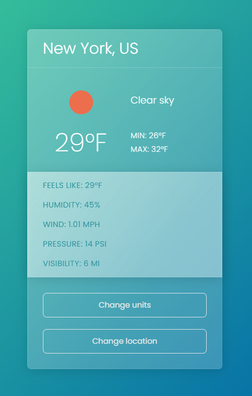
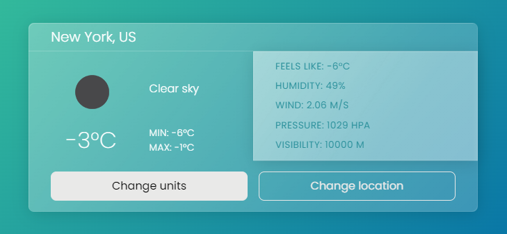
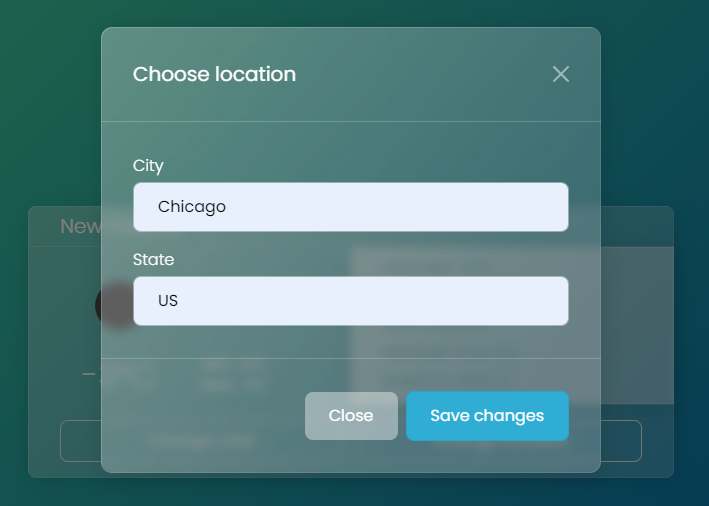
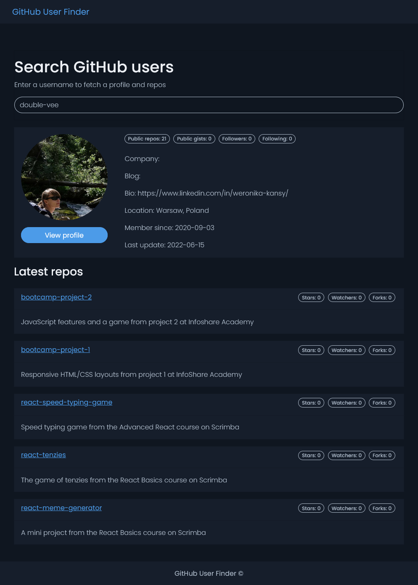

## Contents

- [Weather App](#weather-app)
- [GitHub User Finder](#github-user-finder)

## Weather App

This is a class-based JavaScript app showing current weather data fetched from an API, built as part of Brad Traversy’s _Modern JavaScript From The Beginning_ course.

I modified the course code to make the app work with a different API (Open Weather instead of Weather Underground) and to enable changing units between imperial and metric. I also tweaked the Bootstrap theme to obtain a more responsible mobile layout.

Built with:

- JavaScript ES6 classes
- CSS3 media queries
- Bootstrap 5 + Bootswatch Quartz theme
- OpenWeatherMap API

Live site: [https://double-vee-weather-app.netlify.app](https://double-vee-weather-app.netlify.app)

<figure>
  <figcaption>
    
Change units between metric and imperial:

  </figcaption>
  
</figure>

<figure>
  <figcaption>
    
Change location:

  </figcaption>
  
</figure>

## GitHub User Finder

Another class-based API project from Brad Traversy’s _Modern JavaScript From The Beginning_ course. The app lets you search for GitHub users by username and displays their profile and latest repos.

Built with:

- JavaScript ES6 classes
- CSS3 variables and media queries
- Bootstrap 5 + Bootswatch Superhero theme
- GitHub API

Live site: [https://double-vee-github-user-finder.netlify.app](https://double-vee-github-user-finder.netlify.app)

<figure>
  <figcaption>
    
Start typing to see results:

  </figcaption>
  
</figure>
